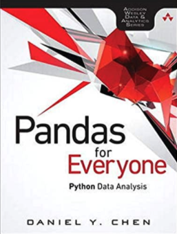
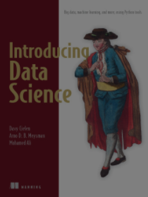

## WEEK1-2 - N1 - Introduction to Data Science Course Structure

### First Class

**Course Code:** ICCS161 - Introduction to Data Science 4(3-2-7)

**Trimeter:** 1, Academic Year 2021-2022 (Sep 2021-Dec 2021)

**Section:** 1

**Date/Time:**  Mon 12:00-13:50 & Wednesday 15:00-16:50

**Office Hours:** Tuesday 14:00-1600

**Lecturer:** Boonyanit Mathayomchan

**E-mail:**  Please see the exact email on Canvas.  *note: send to ???@mahidol.edu* I will try to answer all emails within 24 hours. You can also send me a line message. I will read and respond line messages around midnight.

**Course Description:** Overview of data science; Software stack for data scientists; Acquiring data from online sources; Data cleansing and simple manipulation; Exploratory data analysis and visualization; Statistical inference and modeling; Basic machine learning algorithms; Classification and its applications; Clustering and its applications; Brief introduction to natural language processing; Data science and ethical issues

**Textbooks & Materials:** 

* Pandas for Everyone, Python Data Analysis, Daniel Y. Chen, Addison-Wesley

* [Optional] Introducing Data Science, Davy Cielen, Arno D.B. Meysman, and Mohamed Ali https://www.manning.com/books/introducing-data-science

  

* [Optiona] R for Data Science, *Garrett Grolemund,* *Hadley Wickham https://r4ds.had.co.nz*

**LMS:** [Canvas](https://canvas.instructure.com/)

**Allocation of Marks**

| item                | allocation |
| ------------------- | ---------- |
| Attendance          | 5%         |
| Assignments/Project | 20%        |
| Midterm             | 35%        |
| Final               | 40%        |

**Attendance Policy**

All classes are online. Students must join the conference session within the first 15 minutes. The camera shall be on. Three late is equivalent to one absent. Each absent will get 1% deduction (each late is 0.33% deduction). Students shall maintain at least 80% of the class time in order to take the final exam.

**Grading Criteria**

| Score        | Grade |
| ------------ | ----- |
| 90 ≤ x ≤ 100 | A     |
| 85 ≤ x < 90  | B+    |
| 80 ≤ x < 85  | B     |
| 75 ≤ x < 80  | C+    |
| 70 ≤ x < 75  | C     |
| 65 ≤ x < 70  | D+    |
| 60 ≤ x < 65  | D     |
| x < 60       | F     |

**Topics**

| Date    | Topic                                                     |
| ------- | --------------------------------------------------------- |
| Week 1  | Overview of Data Science and the Toolstack                |
| Week 2  | Basic Programming Concepts for Storing and Accessing Data |
| Week 3  | Data Visualization                                        |
| Week 4  | Data Manipulation                                         |
| Week 5  | Tidy Data and Data Cleaning                               |
| Week 6  | Data Types and Conversions                                |
| TBA     | **Midterm Review & Assessment (35 %)**                    |
| Week 7  | Utilizing Functions for Data Manipulation                 |
| Week 8  | Data Modeling I                                           |
| Week 9  | Data Modeling II                                          |
| Week 10 | Clustering                                                |
| Week 11 | Text Processing                                           |
| Week 12 | Emerging Topics in Data science and Ethical Issues        |
| TBA     | **Final Examination (40 %)**                              |

