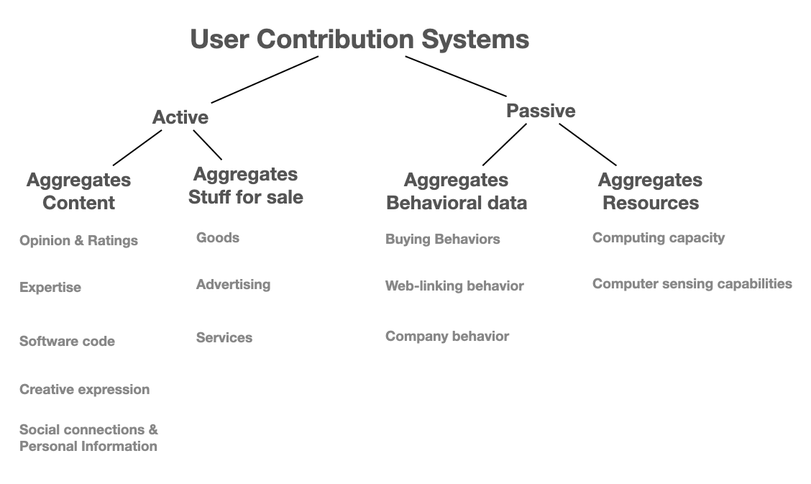
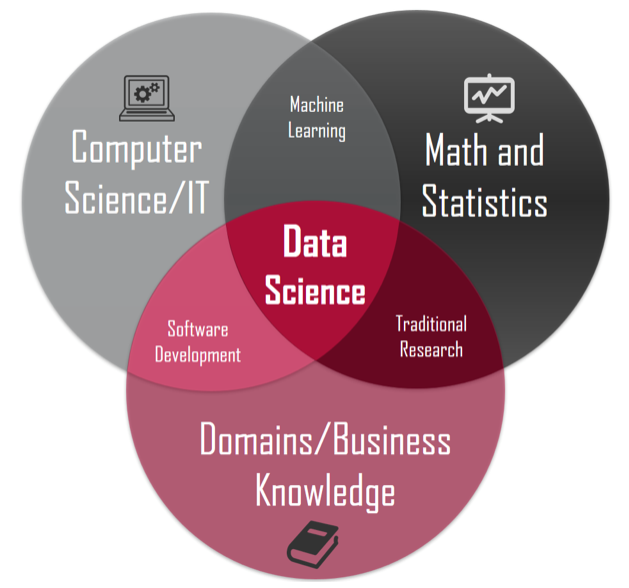
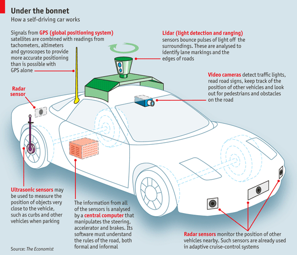
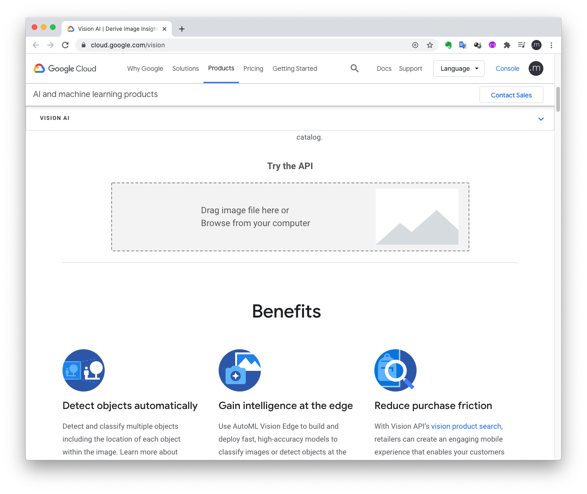
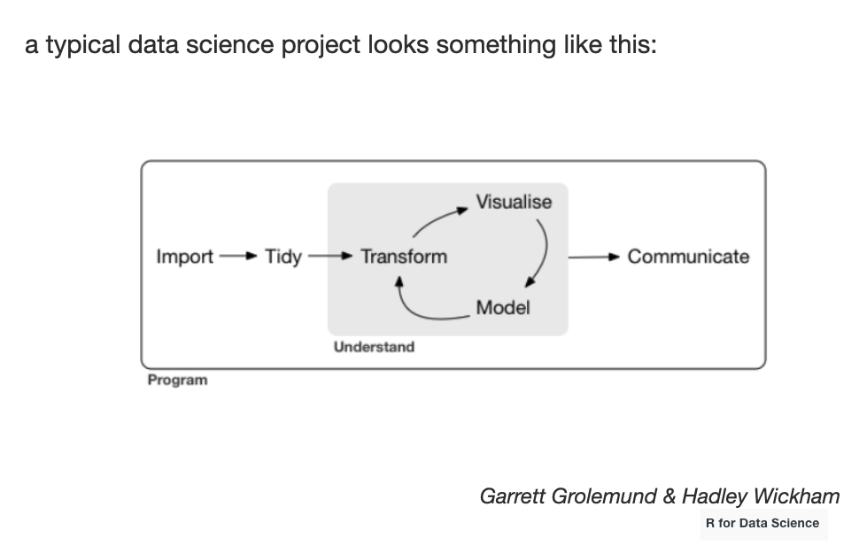
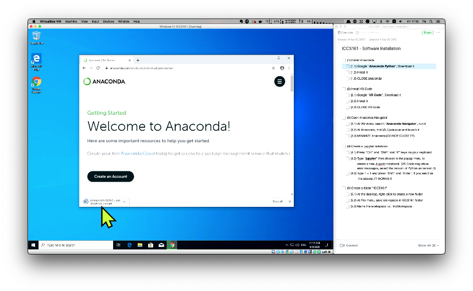

## WEEK1-2 - N2 : Introduction to Data Science

### What is Data Scince ?

> The term "science" implies knowledge gained through systematic study. In one definition, it is a systematic enterprise that builds and organizes knowledge in the form of testable explanations and predictions. Data science might therefore imply a focus involving data and, by extension, statistics, or the systematic study of the organization, properties, and analysis of data and its role in inference, including our confidence in the inference. - Vasant Dhar

_source_ https://cacm.acm.org/magazines/2013/12/169933-data-science-and-prediction/fulltext )

Keywords:

* Data
* Statistics
* Organization
* Properties
* Analysis
* Inference
* Confidence

### What are data?

> **Data** **are measurements or observations that are collected as a source of information.** There are a variety of different types of data, and different ways to represent data. - Australian Bureau of Statistics

_source_ https://www.abs.gov.au/websitedbs/a3121120.nsf/home/statistical+language+-+what+are+data

### Data Science & Big Data, are they the same?

Human have been using information to help us adapt and evolve throughout the evolution. Human brain may not be the best tool to store information for a long period. Many symbols were used to transfer information from. human brain into a tangle form. We can trace back as far as 40,000 years ago.

_source_ http://www.openculture.com/2019/03/40000-year-old-symbols-found-in-caves-worldwide-may-represent-the-earliest-written-language.html

We have been studying and analyzing data to formulate information. In the pre-computer era, data were created and recorded to media in various forms. For example:

* Text and number -> Papers, Books
* Picture & Motion Picture -> Paper, Canvas, Film
* 3D Object -> Sculpture
* Voice -> Ninyl,  Casset Tape

Generating data into the forms listed above is time consuming and can be very expensive. Processing information in those forms also takes a long time. The field of **statistics** studies about collecting data and analyzing data. Until recently, with the Internet and mobile devices, data are generated easily and the volume of data is very large.

**How much data is generated each day?**

>500 million tweets are sent
>
>294 billion emails are sent
>
>4 petabytes of data are created on Facebook
>
>4 terabytes of data are created from each connected car
>
>65 billion messages are sent on WhatsApp
>
>5 billion searches are made

_source_ https://www.weforum.org/agenda/2019/04/how-much-data-is-generated-each-day-cf4bddf29f/

**Let's guess, how much (duration) of video uploaded to Youtube very minute ?**

_answer_ https://www.statista.com/statistics/259477/hours-of-video-uploaded-to-youtube-every-minute/

**We may contribute to the society and generate more than data than we think.**

_Suggested by Cook ( The Contribution Revolution: Letter Volunteers Build Your Business. )_

Back to the question, the data these days are big. However, data science is not big data, but it provides methodologies/toolds in dealing with data, and this **can be extended to tackle big data**.

Data Science is not one specific field but a combinations of various field.

### Benefits and Used of data science 

Data science is used almost everwhere. Big companies have been using data science to extract business opportuntities. Famous cases:

**Walmart**
_New York Time story from 2004._

* If you were a manager at Walmart, what would you stock for your branch when that area is about to get. hit by a hurricane?

​	The answer is ..............

**Target**

Target use purchasing behavior of customers to propose them incentive (discount/coupons) targeted for that particular customer. ( This case is very interesting. We will discuss more about this when we learn about ethical issues and data science. )

**Tesla**

Tesla put sensors in a car such that various information is sent to the computer to process it. This result it a self-driving car (under certain condition). Advanced algorithms are deleveloped to tackle this problem. Most of the advance algorithms can also be classified under the term called MACHINE LEARNING or ARITIFICIAL INTELLIGENCE. 

_source_ The Data Science Behind Self-Driving Cars https://medium.com/@feiqi9047/the-data-science-behind-self-driving-cars-eb7d0579c80b

### Facets of Data

Data come in various forms. The main categories of data are:

* Structured
* Unstructed
* Natural language
* Machine-generated
* Graph-based
* Audio, video, and images
* Streaming

**Structured Data**

Structued data is stored according to a data model. The data model specifies what type of data is recorded, in what order, and the length or precision of the data. Excel is a good example of a tool to store structured data. _Note: This does not imply that all data in Excel format is structured data!_

Most of data we will be working with this term fall into this category. To get ourself used to with this, let's do something.

**In-class activity 1** (15 minutes): 

1. Form a group of 5 students
2. Pick one of these topics
   * Food you ate last week
   * Music you listened to last week
   * Item you purchased last month
   * Movies you watched last year
   * Places you visited last year
   * Cloth you purchased last year
   * Classes you took last year
3. Use Excel to store the data ( You can store the data in any way, any level of detail.. sky is the limit.  There is no right or wrong.)
4. Discuss in the group, given the way you store the data, what could you do with that? 
5. Capture the screen of Excel created step#3 and write a short summary from step#4, submit on canvas (later on this week)

**Unstructured Data**

Unstructured data is the data that doesn't conform to the data model. An email address is a good example. When we email to our friends, we may write in anyway we want. We don't have to write in paragraphs (i.e., introduction, body, conclusion).

**Natural Language**

Natural language is the language we use in daily life. There may be certain rules/grammar to govern the language. However, we don't have to strictly follow the rule. We can break some of those rules while still achiving the goal (to convey the message). Natural language is a subset of unstructued data.

**Machine-generated data**

Even we didn't intentionally create data. The machine surronding us may generate data for us. For example, we carry a mobile phone with us. Even we didn't send any message to any one. The mobile phone operator knows our location (apprroximately) because the phone regularly communicate with the operator stations.

 

**Graph-based or network data**

When you create a friend request on Facebook, you are differentiating that person from billion persons on the platform. Genering a friend request implies that you know that person or you want to know that person. If the other person accept your request, this establish that the two are friend and willing to know updates, send/receive messages from each other. 

This lead to one interesting suggestion "Six Degrees of Separation". 

https://www.youtube.com/watch?v=TcxZSmzPw8k

Another example of connection is when we are using Twitter. When one user follows another one. This create a one way relationship. 

These from of information can be captured,stored, and analyzed with knowledge from a field called **Graph Theory**.

**Audio, Image, and Video**

As we discuss earlier, these days users around the world post video on YouTube or post photos on Instagram, or post Music on SoundCloud. This type of information can also be processed with special type of algorithm.

Let's try this: (see the demo) https://cloud.google.com/vision

**Streaming data**

Data of what is happening is send to the viewer continuously. The content of data that is coming to the viewer can be any form. For example, stream of stock price data, stream of music, live event, or Twitter trending.

### Data Science Project Cycle

We will discuss more in detail in the future.

### Toolstack

We will use Python with libraries to help us do the tasks as shown in the diagram above. Let's install Anaconda (Python) & Related tools

**These are the installation steps:** 

## OSX

(1) Install Anaconda

​	(1.1) Download it from https://www.anaconda.com/products/individual-d

​	(1.2) Install with all default settings

(2) Install Jupyter
	(2.1) Open Anaconda Navigator
	(2.2) Find Jupyter Notebook icon then click install (if the button is "Launch", it is good. We are done.)
	(2.3) Close Anaconda

(3) Install VS Code

​	(3.1) Open Anaconda Navigator
​	(3.2) Find VS Code icon then click install (if the button is "Launch", it is good. We are done.)
​	(3.3) Close Anaconda

## Windows

(1) Install Anaconda
	(1.1) choose an option to set the PATH

(2) Install Jupyter
	(2.1) Open Anaconda Navigator
	(2.2) Find Jupyter Notebook icon then click install (if the button is "Launch", it is good. We are done.)
	(2.3) Close Anaconda

(3) Install VS Code

(4) Open Anaconda Navigator 
	(4.1) On windows, search Anaconda Navigator..run it
	(4.2) Find VS Code icon and launch it
	(4.3) Minimize Anaconda (don't close)

 

If you prefer, you can also see the recorded video or the installation process.

https://youtu.be/WVgp0DHqMG4

## If VS Code doesn't work, don't worry

If VS Code doesn't work, we can run. using Jupyter Notebook. That's perfectly fine. Actually, there are some features that work on Jupyter but VS Code still cannot do it. 

ๆ
