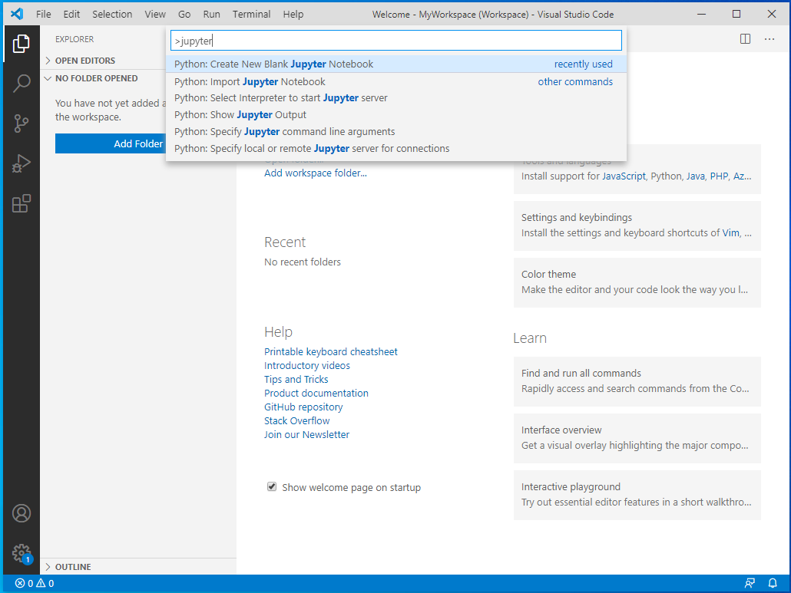
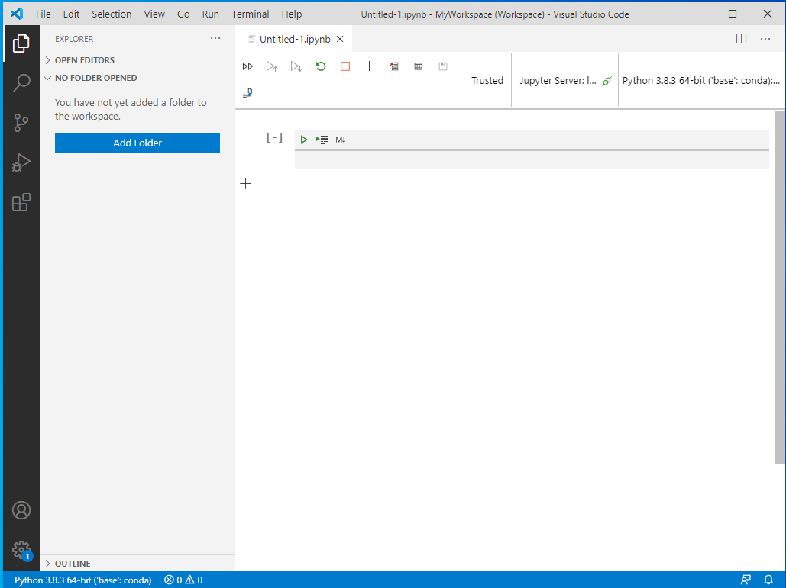
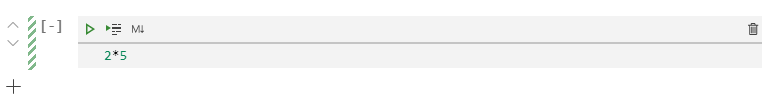
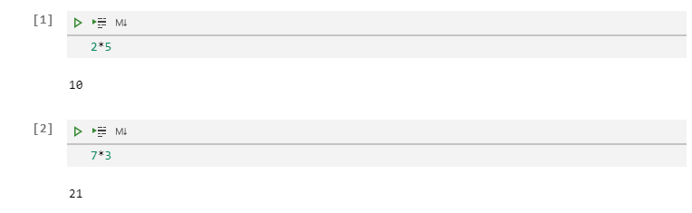
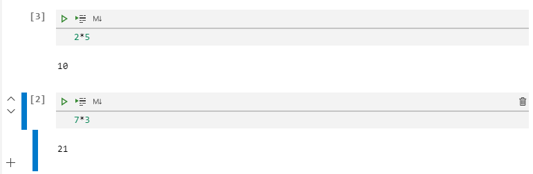

## WEEK1-2 - N3 : What is a Jupyter Notebook

​	A Jupyter notebook is a file format that allows us to write code (here, we use Python), run it, get the result, and save additional information into one file. You may think about a Jupyter notebook like a very powerful Microsoft Word that can hold images,text,scirpt, and outcome of the script in one file. 

​	Normally, when we write a program or a script, we can add comment to our code. It is considered as a good practice to add comments. This will help us understand about that the program is doing. 

​	In Jupyter notebook, we can write a python script easily. There are some rules (syntax) that we have to follow so that Python understand what to do. We will talk about that in the next lesson. Let's start with a very basic python script in Jupyter Notebook:

### Let's create a Jupyter Notebook

1. Open "Anaconda Navigator"
2. Launch VS Code
3. Create a Jupyter notebook by pressing key "Ctrl" + "Shift" + "P". ( "Cmd" + "Shift" + "P" for Mac).
4. In the popup window, type "jupyter", you will see options. Select **Create New Blank Jupyter Notebook**.

_Note: These steps are what we we always do. Hence, it the future, I won't explicitely list them._

VS Code will create a new blank notebook for us.

	The shaded box is called **a cell**. We can write Python code into a cell. One notebook normally have many cells. We can think about a cell as a container that we can put Python code there. Later on, we **can** choose to run only the code in any particular cell, not all cells in the whole Jupyter notebook. Of course, if we want, we can run all cells.

5. In the cell, write a Python as script as shown:

This simple math express also confirms with Python syntax. Therefore, we can consider this as a Python script and we can run it. There are many ways to run this cell.

We should have this result:

Under the cell is the output that the Python code generates.

Another way to run the cell is by clicking the Triangle icon.

6. Let's add more code into the cell below as shown, and then click the triangle to run it. 

   

Notice that the value inside the bracket is 2. This number **is not** the cell number. It is the order of execution. If we click the triangle icon (run) at the top cell, we will get this.

Notice that the number inside the brackets of the top cell is 3.

_Note: The bar on the left indicates which cell is selected._

